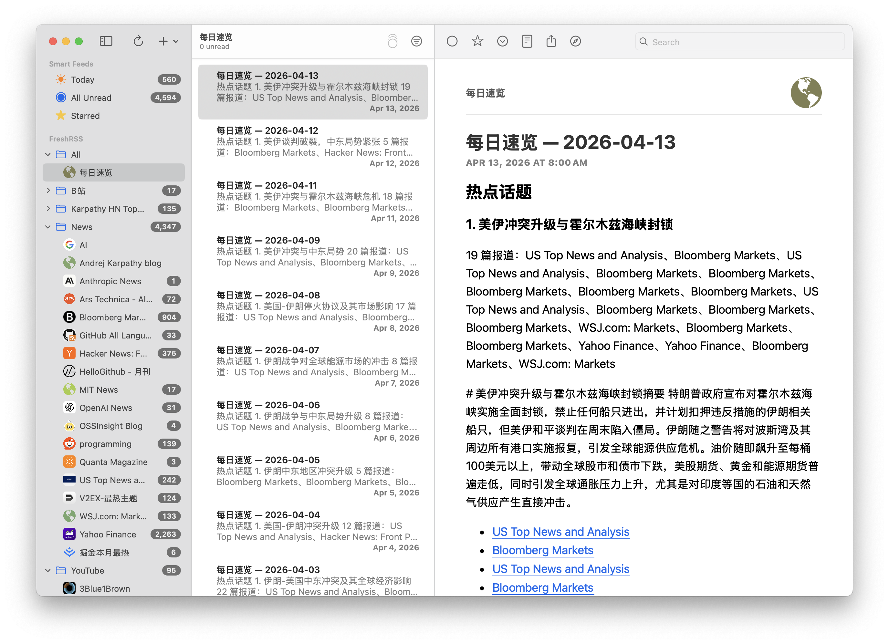
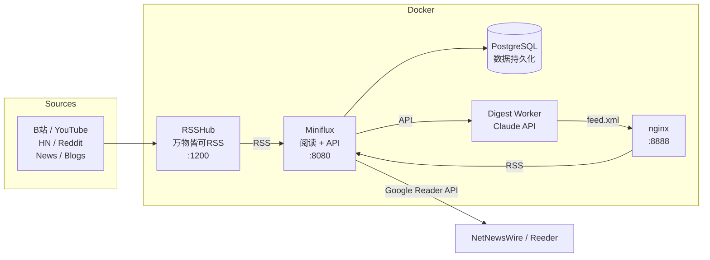

# RSS Feed Hub

> **Open, hackable, yours.**

A self-hosted information aggregator. No algorithms, no ads, no tracking — just your subscriptions, in chronological order, on your own machine.



## Architecture



| Component | Role | Port |
|-----------|------|------|
| [RSSHub](https://github.com/DIYgod/RSSHub) | Turns "everything" into RSS — Bilibili, YouTube, Reddit, and 1000+ more | 1200 |
| [Miniflux](https://github.com/miniflux/v2) | Minimal, fast RSS reader with a full REST API | 8080 |
| PostgreSQL | Stores feeds, articles, and read state | 5432 (internal) |
| [NetNewsWire](https://github.com/Ranchero-Software/NetNewsWire) | macOS/iOS native client (connects via Google Reader API) | — |
| Digest Worker | AI-powered daily digest — filters, clusters, summarizes articles | cron (internal) |
| nginx | Serves digest RSS feed | 8888 |

## Quick Start

```bash
git clone https://github.com/parle-ai/rss-feed-hub.git && cd rss-feed-hub
cp .env.example .env   # Edit: set passwords and cookies
docker compose up -d
open http://localhost:8080
```

## Current Feeds

| Category | Sources |
|----------|---------|
| **B站** | Bilibili followings (via RSSHub) |
| **YouTube** | 52 channels (native RSS) |
| **News** | Hacker News, Ars Technica, MIT News, OpenAI, Bloomberg, WSJ, CNBC, etc. |
| **Karpathy HN Top Blogs** | 91 most popular blogs from Hacker News 2025 |

## Daily Digest

AI-powered daily summary of your feeds — hot topics, must-reads, and notable articles, all in Chinese.

Digest feed is already subscribed in Miniflux and syncs to NetNewsWire automatically via Google Reader API. The digest worker generates `feed.xml` daily at 08:00, served by nginx at `http://nginx/feed.xml` (Docker internal) / `http://localhost:8888/feed.xml` (host).

Configure must-read feeds in `digest/config.yaml`. Requires `ANTHROPIC_API_KEY` and `MINIFLUX_API_KEY` in `.env`.

## Native Client Support

Miniflux exposes a Google Reader-compatible API:

1. NetNewsWire → Settings → Accounts → Add → **FreshRSS**
2. API URL: `http://localhost:8080` (no trailing slash)
3. Credentials: set in Miniflux → Settings → Integrations → Google Reader

Also works with: Reeder, lire, News Explorer, FeedMe, and [more](https://miniflux.app/docs/apps.html).

## Roadmap

- [x] AI-powered daily digest (Claude API — filters, clusters, summarizes)
- [ ] Custom frontend dashboard (Miniflux REST API)
- [ ] Xiaohongshu integration (custom scraper)
- [ ] Mobile push notifications

## Docs

- [How It Works](docs/how-it-works.md) — Visual guide to RSS, RSSHub, Docker, Miniflux, NetNewsWire
- [Design Spec](docs/superpowers/specs/2026-03-25-info-aggregator-design.md)
- [Daily Digest Design](docs/superpowers/specs/2026-04-01-daily-digest-design.md)
- [Implementation Plan](docs/superpowers/plans/2026-03-25-info-aggregator.md)

## License

MIT
