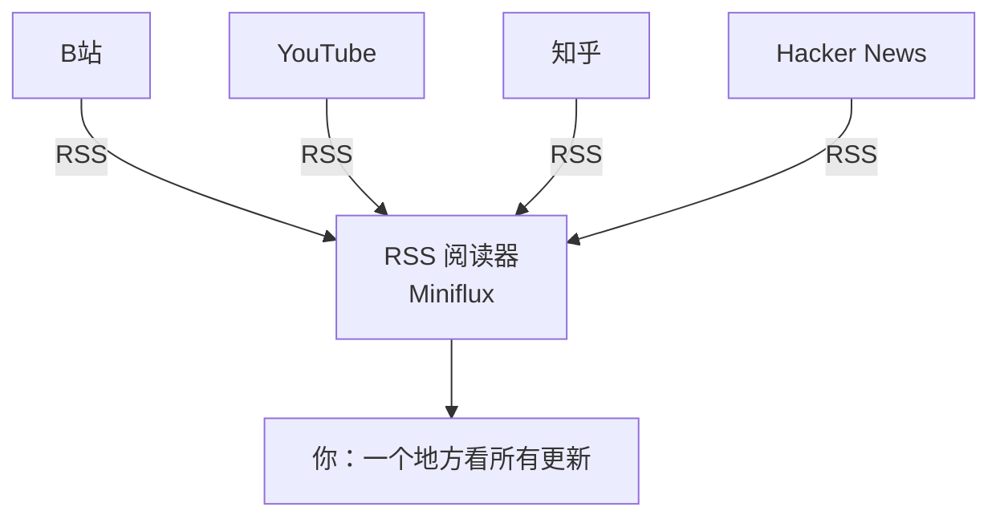
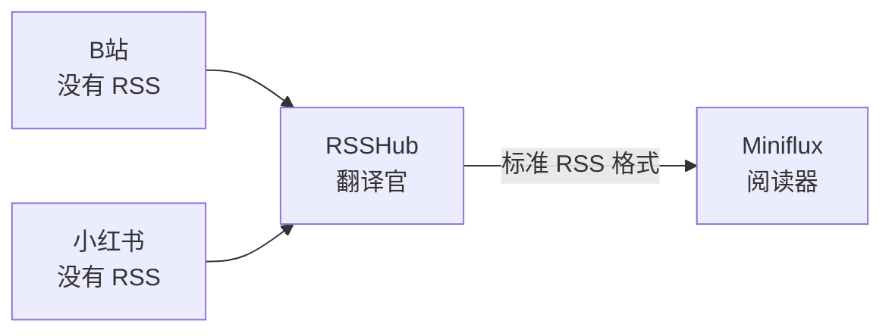
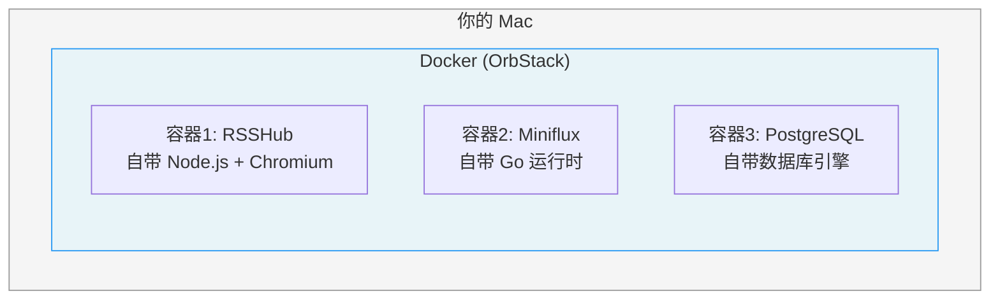
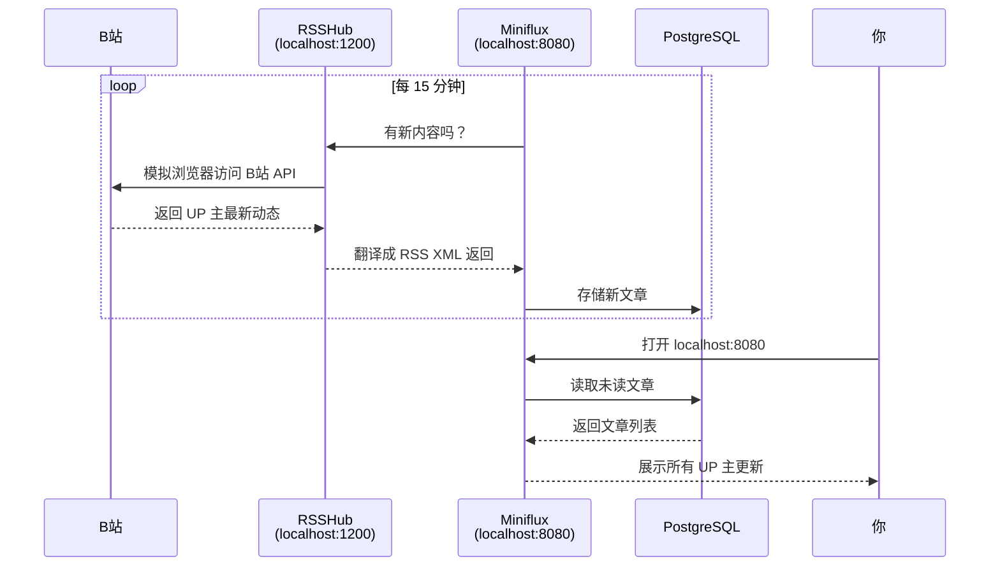

# 原理图解：RSS + RSSHub + Docker + Miniflux

## 一、什么是 RSS？

想象**报纸订阅**：

```
没有 RSS 的世界：

  B站      YouTube     知乎       HN
   │          │          │         │
   ▼          ▼          ▼         ▼
  你每天要打开 4 个网站，一个一个翻，看有没有更新
```

**RSS** 就像一个统一的"邮箱"。每个网站把更新打包成一种标准格式（XML），
你用一个阅读器订阅，新内容自动送到你面前：



RSS 本质就是一个**标准化的更新通知协议**。
就像 email 不管你用 Gmail 还是 Outlook 都能收发，RSS 不管哪个网站，格式都一样。

---

## 二、问题：很多网站不提供 RSS

B站、小红书、微博……这些平台**故意不给你 RSS**，因为它们要你打开 App 看广告。

这就是 **RSSHub** 解决的问题：



**RSSHub 就是一个"翻译官"** — 它模拟浏览器去访问 B站/小红书，
把页面内容抓下来，翻译成标准 RSS 格式。这样 Miniflux 就能订阅了。

---

## 三、什么是 Docker？

你装一个软件，通常要操心：装什么版本的数据库？环境变量怎么配？
会不会跟我电脑上其他东西冲突？

**Docker 就是"软件的集装箱"：**



每个容器是一个隔离的小世界，里面自带运行所需的一切。
**Docker Compose** 则是"编排工具" — 用一个 `docker-compose.yml` 文件
定义"我要 3 个容器，它们怎么连接"，然后 `docker compose up` 一键全部启动。

---

## 四、完整数据流



---

## 五、一句话总结

| 组件 | 角色 | 类比 |
|------|------|------|
| **RSS** | 标准更新格式 | 信件格式（信封+地址+内容） |
| **RSSHub** | 把不支持 RSS 的网站转成 RSS | 翻译官 / 代购 |
| **Miniflux** | RSS 阅读器 + 数据库 | 你的统一邮箱 |
| **Docker** | 让软件互不干扰地运行 | 集装箱：每个软件住自己的箱子 |
| **Docker Compose** | 一键编排多个容器 | 集装箱调度表 |
| **OrbStack** | macOS 上的 Docker 引擎 | 码头（让集装箱能跑起来） |
